# Procesverslag
Markdown is een simpele manier om HTML te schrijven.  
Markdown cheat cheet: [Hulp bij het schrijven van Markdown](https://github.com/adam-p/markdown-here/wiki/Markdown-Cheatsheet).

Nb. De standaardstructuur en de spartaanse opmaak van de README.md zijn helemaal prima. Het gaat om de inhoud van je procesverslag. Besteedt de tijd voor pracht en praal aan je website.

Nb. Door *open* toe te voegen aan een *details* element kun je deze standaard open zetten. Fijn om dat steeds voor de relevante stuk(ken) te doen.

## Jij

  
uitwerken voor kick-off werkgroep

  ### Auteur:
  Sil Taal

  #### Je startniveau:
  Blauw

  #### Je focus:
  Responsive design
 

## Je website

  
uitwerken voor kick-off werkgroep

  ### Je opdracht:
  https://www.mcdonalds.com/nl/nl-nl.html 

  | Screenshot(s) van eerste pagina (small screen) | Screenshot(s) van tweede pagina (small screen) |
  | ---            | ---                |
  | McDonald's Homepage | McDonald's Coca-Cola |
  | 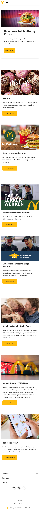 | 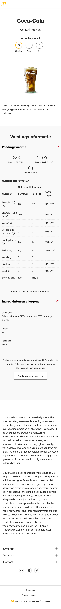 |

## Toegankelijkheidstest 1/2 (week 1)

  
uitwerken na test in 2e werkgroep

  ### Bevindingen
  Voor deze test heb ik de officiële website getest van McDonald's Nederland.

  1. De homepage heeft geen h1 waardoor het voor de (luisterende) gebruiker niet duidelijk is waar de website over gaat. Alle andere pagina's hebben daarentegen wel een h1.
  2. De afbeeldingen van alle items op het menu hebben geen alt-tekst. De gebruiker hoort dan alleen maar "Unlabelled Image".
  3. Veel onnodige div's in de html code
  4. De teksten zijn duidelijk te begrijpen en je kan makkelijk navigeren door de website met de voiceover.

  ### WCAG checklist

  | WCAG checklist     | yes/no         |
  | ---            | ---                |
  | Use plain language and avoid figures of speech idioms, and complicated metaphors | yes |
  | Make sure that button, a (links), and label (in forms) content is unique and descriptive | yes |
  | Validate your HTML | no |
  | Use a lang attribute on the html element | yes |
  | Provide a unique title for each page | yes |
  | Ensure that viewport zoom is not disabled | yes |
  | make sure there is a visible focus style for interactive elements that are navigated to via keyboard input | yes |
  | Check to see that keyboard focus order matches the visual layout | yes |
  | Check that the site can be rotated to any orientation | yes |
  | Remove horizontal scrolling | yes |
  | Ensure that button and link icons can be activated with ease | yes |
  | Ensure sufficient space between interactive items in order to provide a scroll area | yes |
  | Use heading elements to introduce content | yes |
  | Use only one h1 elemet per page or view | yes |
  | Heading elements should be written in a logical sequence | no |
  | Don't skip heading levels | no |
  | Use list elements for list content | yes |
  | Make sure that all img elements have an alt attribute | no |
  | Make sure that decorative images use null alt attribute values | yes |
  | Provide a text alternative for complex images such as charts, graphs and maps | no |
  | For images contaning text, make sure the alt description includes the image's text | yes |
  | Make sure that media does not autoplay | yes |
  | Check to see that all media can be paused | yes |
  | Video - Confirm the presence of catiopns | yes |
  | Audio - Confirm that transcripts are available | yes |
  | Use the a element for links | yes |
  | Ensure that links are recognizable as links | yes |
  | Ensure that controls have :focus states | yes |
  | Use the button element for buttons | yes |
  | Provide a skip link and make sure that it is visible when focused | yes |
  | Identify links that open in a new tab or window | yes |
  | Check if dark and light mode are supported | no |
  | Check if high-contrast mode is supported | no |
  | Increase text size to 200% | no |
  | Make sure color isn't the only way information is conveyed | yes |
  | Ensure animations are subtle and do not flash too much | yes |
  | Provide a mechanism to pause background video | yes |
  | Make sure all animations obeys teh prefers-reduced-motion media query | yes |
  | Check the contrast for all normal-sized text | yes |
  | Check teh contrast for all large-sized text  | yes |
  | Check the contrast for all icons | yes |
  | Check text that overlaps images or videos | yes |
  | Check custon ::selection colors | yes |

 - 8x no  
 - 35x yes

## Breakdownschets (week 1)

  
uitwerken na afloop 3e werkgroep

  | Breakdownschets van eerste pagina (small screen) | Breakdownschets van tweede pagina (small screen) |
  | ---            | ---                |
  | Mcdonald's Homepage | McDonald's Coca-Cola |
  | 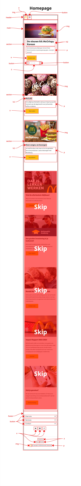 | 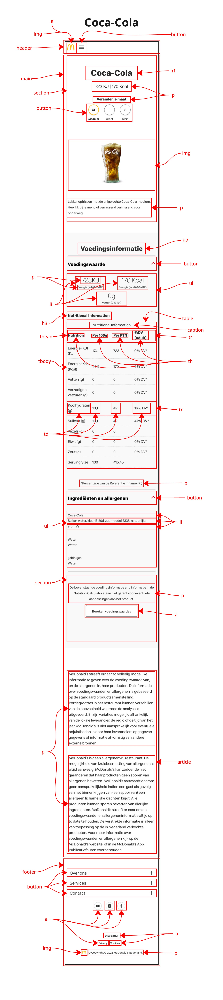 |

## Voortgang 1 (week 2)

  
uitwerken voor 1e voortgang

  ### Stand van zaken
  HTML code voor eerste pagina is geschreven.

  ### Verslag van meeting
  hier na afloop snel de uitkomsten van de meeting vastleggen

  - Sommige <button>buttons</button> veranderen in <a>a'tjes</a>
  - Carrousel verwerken in een ul li
  - summary details gebruiken voor footer

## Voortgang 2 (week 3)

  
uitwerken voor 2e voortgang

  ### Stand van zaken
  Hamburgermenu met summary details gefixt en begonnen met stijling voor eerste pagina.

  ### Verslag van meeting
  hier na afloop snel de uitkomsten van de meeting vastleggen

  - Het is handiger om hamburgermenu te maken met JavaScript
  - Custom properties voor kleuren
  - @media query gebruiken voor responsiveness en light/dark mode

## Toegankelijkheidstest 2/2 (week 4)

  
uitwerken na test in 9e werkgroep

  ### Bevindingen
  Voor deze test heb ik mijn eigen website getest.

  ### WCAG checklist

  | WCAG checklist     | yes/no         |
  | ---            | ---                |
  | Use plain language and avoid figures of speech idioms, and complicated metaphors | yes |
  | Make sure that button, a (links), and label (in forms) content is unique and descriptive | yes |
  | Validate your HTML | yes |
  | Use a lang attribute on the html element | yes |
  | Provide a unique title for each page | yes |
  | Ensure that viewport zoom is not disabled | yes |
  | make sure there is a visible focus style for interactive elements that are navigated to via keyboard input | yes |
  | Check to see that keyboard focus order matches the visual layout | yes |
  | Check that the site can be rotated to any orientation | yes |
  | Remove horizontal scrolling | yes |
  | Ensure that button and link icons can be activated with ease | yes |
  | Ensure sufficient space between interactive items in order to provide a scroll area | yes |
  | Use heading elements to introduce content | yes |
  | Use only one h1 elemet per page or view | yes |
  | Heading elements should be written in a logical sequence | yes |
  | Don't skip heading levels | yes |
  | Use list elements for list content | yes |
  | Make sure that all img elements have an alt attribute | yes |
  | Make sure that decorative images use null alt attribute values | yes |
  | Provide a text alternative for complex images such as charts, graphs and maps | yes |
  | For images contaning text, make sure the alt description includes the image's text | yes |
  | Make sure that media does not autoplay | yes |
  | Check to see that all media can be paused | yes |
  | Video - Confirm the presence of catiopns | yes |
  | Audio - Confirm that transcripts are available | yes |
  | Use the a element for links | yes |
  | Ensure that links are recognizable as links | yes |
  | Ensure that controls have :focus states | no |
  | Use the button element for buttons | yes |
  | Provide a skip link and make sure that it is visible when focused | no |
  | Identify links that open in a new tab or window | yes |
  | Check if dark and light mode are supported | yes |
  | Check if high-contrast mode is supported | no |
  | Increase text size to 200% | no |
  | Make sure color isn't the only way information is conveyed | yes |
  | Ensure animations are subtle and do not flash too much | yes |
  | Provide a mechanism to pause background video | yes |
  | Make sure all animations obeys teh prefers-reduced-motion media query | yes |
  | Check the contrast for all normal-sized text | yes |
  | Check teh contrast for all large-sized text  | yes |
  | Check the contrast for all icons | yes |
  | Check text that overlaps images or videos | yes |
  | Check custon ::selection colors | yes |

 - 4x no  
 - 39x yes

## Voortgang 3 (week 4)

  
uitwerken voor 3e voortgang

  ### Stand van zaken
  Niet aanwezig bij voortang wegens ziek, wel via Teams de docent bericht.

  ### Verslag van meeting
  hier na afloop snel de uitkomsten van de meeting vastleggen

  - Readme bijwerken
  - Op regel 89 van index onnodige article, die moet weg.
  - Passende titel toevoegen in de head

## Eindgesprek (week 5)

  
uitwerken voor eindgesprek

  ### Je uitkomst - karakteristiek screenshots:
  | Light mode | Dark mode |
  | ---            | ---                |
  | Homepage op desktop formaat | Homepage op Desktop formaat |
  | 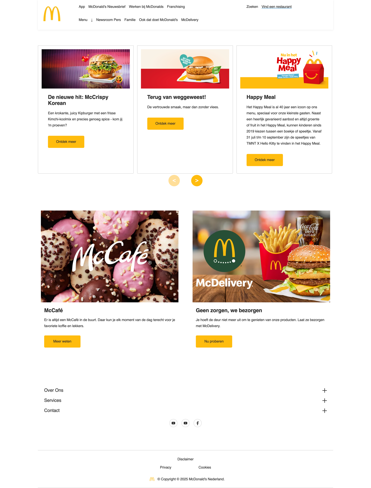 | 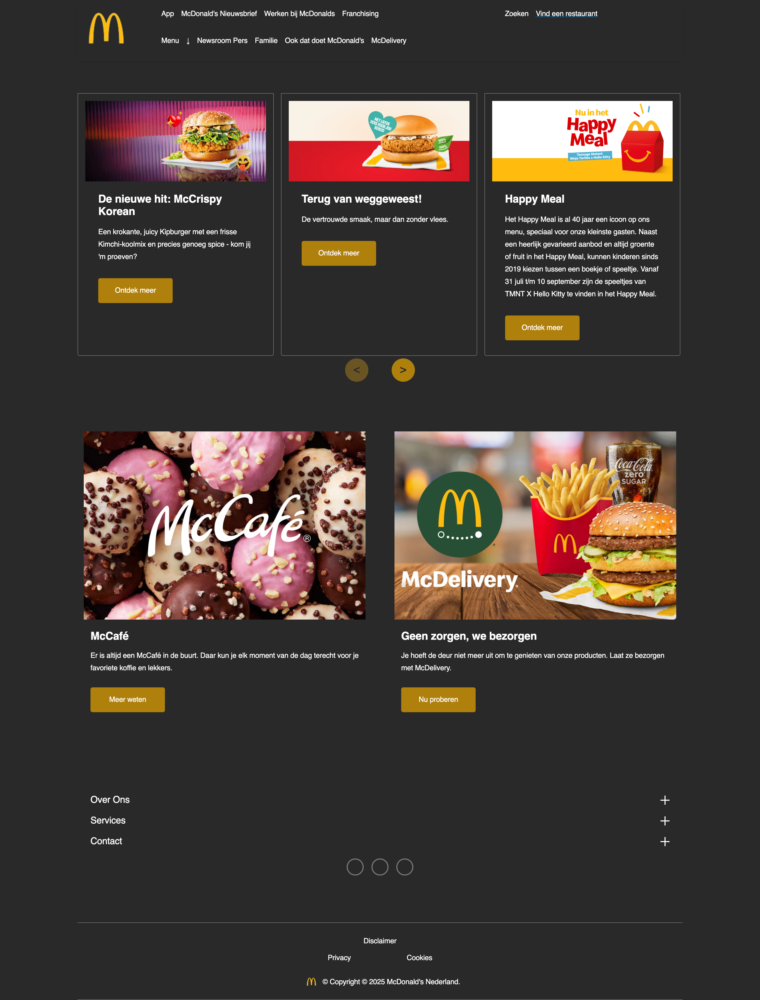 | 
  | 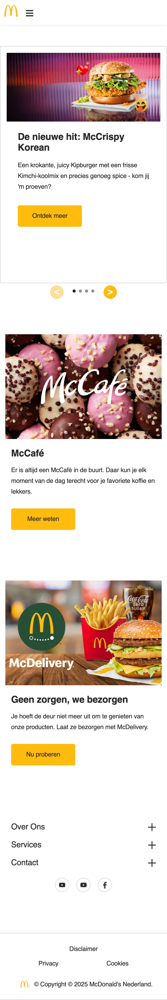 | 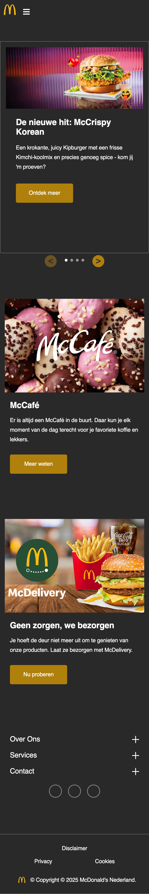 |
  | Cola op tablet en phone formaat | Cola op tablet en phone formaat |
  | 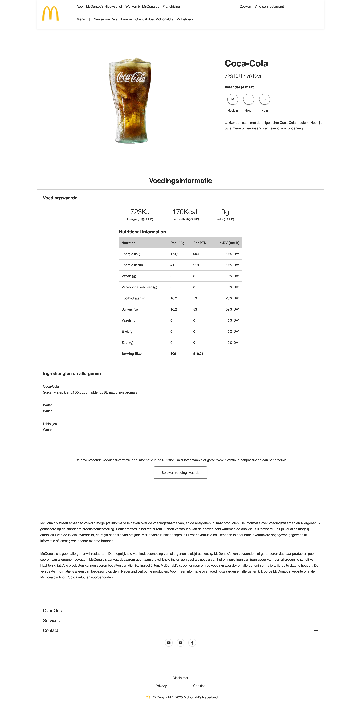 | 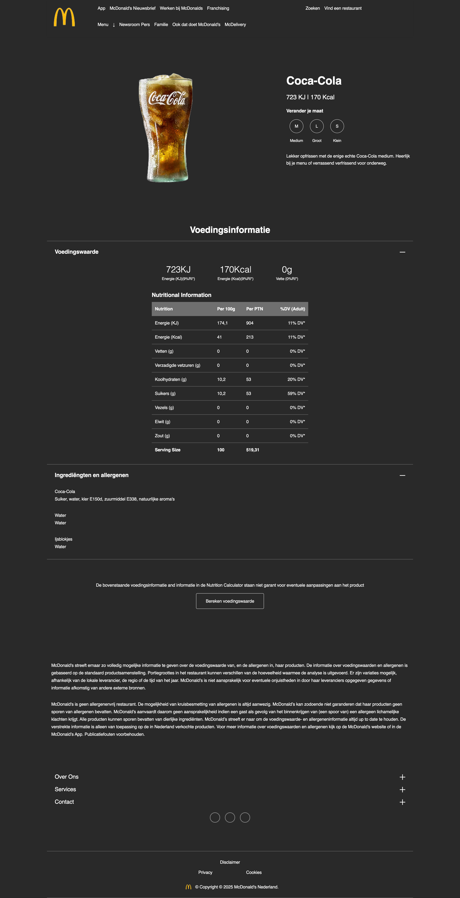 |
  | 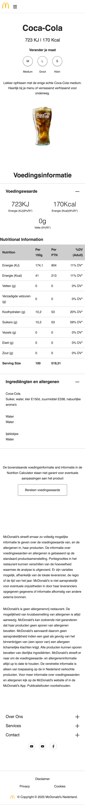 | 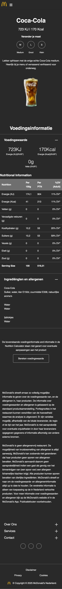 |

  ### Dit ging goed/Heb ik geleerd: 
  |  | Wat heb ik geleerd | Screenshot |
  | --- | --- | --- |
  | 1 | Ik heb geleerd hoe je met display: grid; elementen kan stijlen | 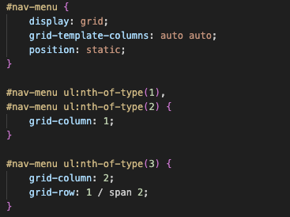 |
  | 2 | Ik heb geleerd hoe je met HTML elementen een tabel kan maken | 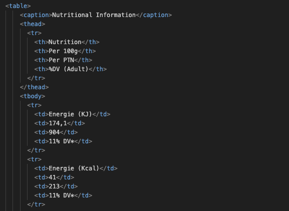 |
  | 3 | Ik heb geleerd hoe je met HTML elementen een uitklapbare sectie kan maken | 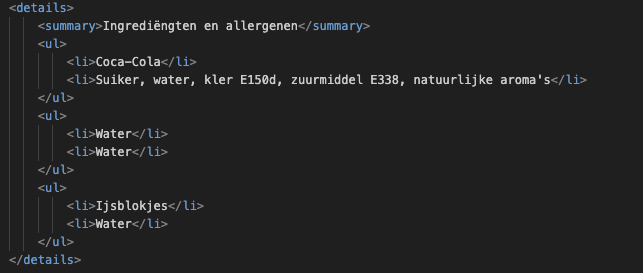 |
  | 4 | Ik heb geleerd hoe je met nieuwe CSS pseudo classes en elementen kan werken | 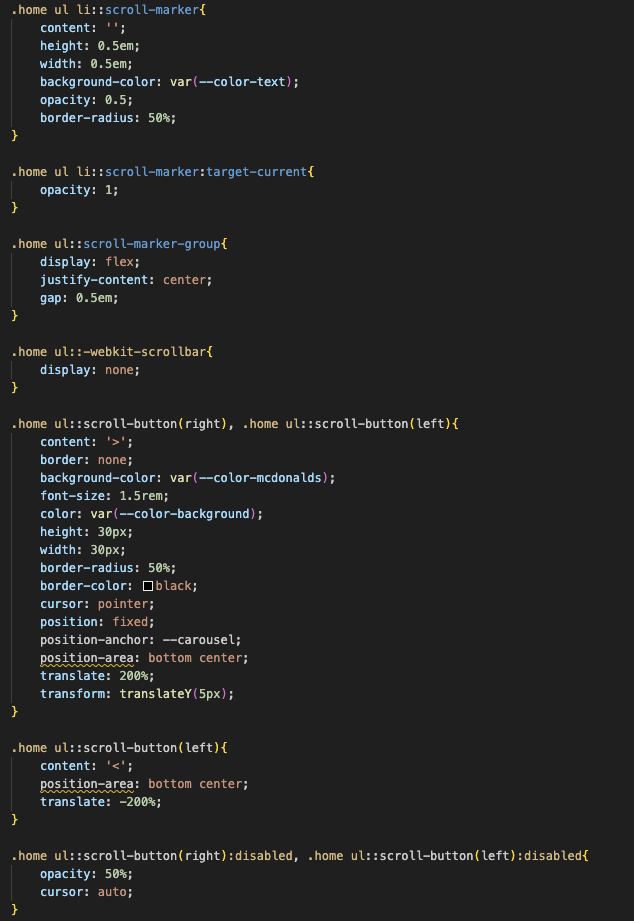 |
  | 5 | Ik heb geleerd hoe je met custom properties kleur kan aanpassen | 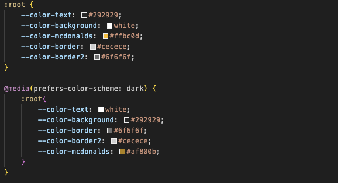 |
  | 6 | Ik heb geleerd hoe je met een media query responsiveness kan maken | 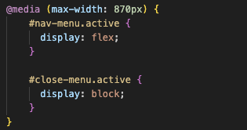 |
  | 7 | Ik heb geleerd hoe je met een media query dark/light mode kan maken | 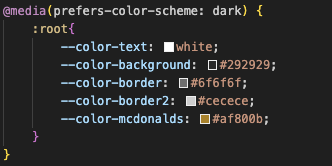 |
  | 8 | Ik heb geleerd dat je met "nth-of-type()" of "first/last-of-type" bepaalde elementen kan selecteren voor stijling | 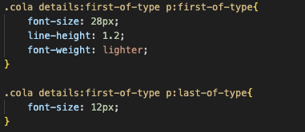 |
  | 9 | Ik heb geleerd hoe je met JavaScript een hamburgermenu kan maken | 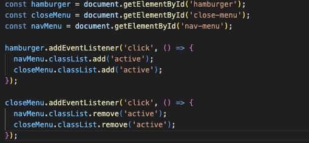 |

  ### Dit was lastig/Is niet gelukt:
  |  | Wat niet gelukt is | Screenshot |
  | --- | --- | --- |
  | 1 | Het is niet gelukt om de footer anders te stijlen op desktop formaat | 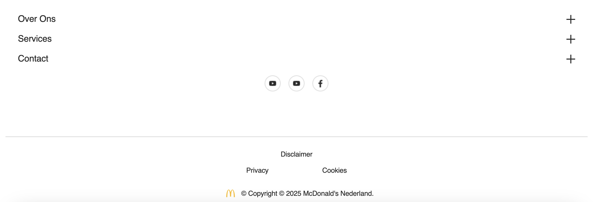 |
  | 2 | Het is niet gelukt om de carrousel op desktop formaat 1 op 1 na te maken van de officiële site van McDonalds Nederland | 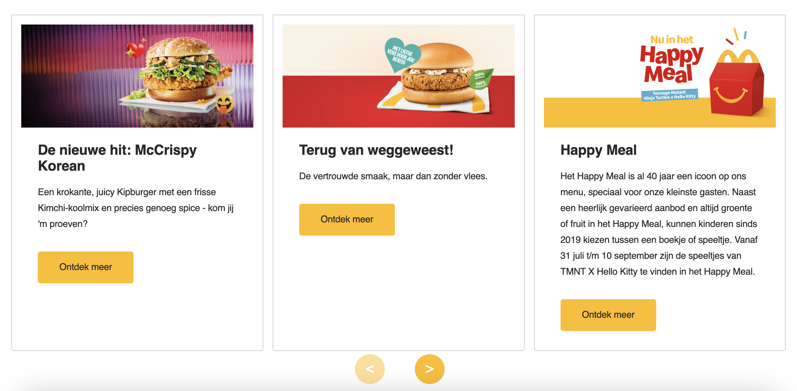 |

## Bronnenlijst

  
Bronnen

  1. Algemene stijling via inspect https://www.mcdonalds.com/nl/nl-nl.html
  1. Stijling voor carrousel https://www.youtube.com/watch?v=gmI5nvzv170
  2. Stijling voor tabel op cola pagina https://chatgpt.com/share/68dc480b-fe54-800d-aca8-f2530c12c4b5 
  3. Stijling voor details en summary https://css-tricks.com/using-styling-the-details-element/ 
  4. Stijling voor positioning van voedingswaarde, nav bar en home https://copilot.microsoft.com/shares/dFux4jaUBUGyZ1jdPHKpN 
  5. JS code voor hamburgermenu van https://copilot.microsoft.com/shares/Nvg4tjRvtfiHyJKS8S3WV 

